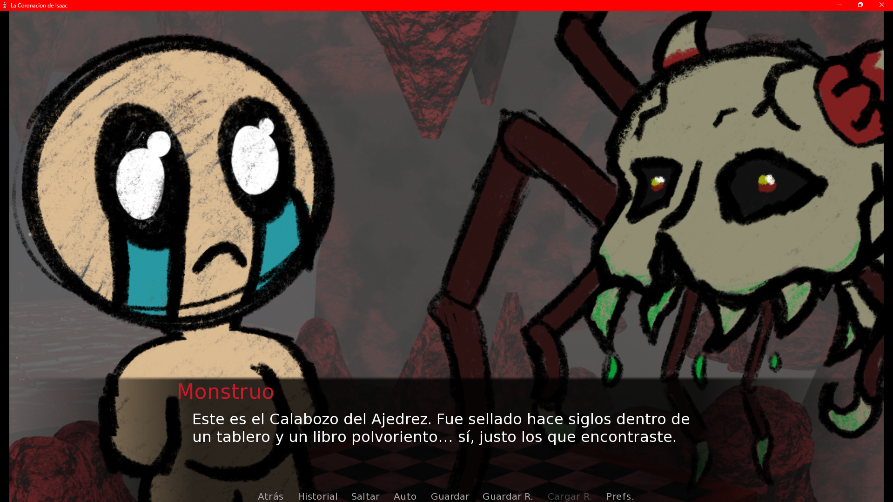
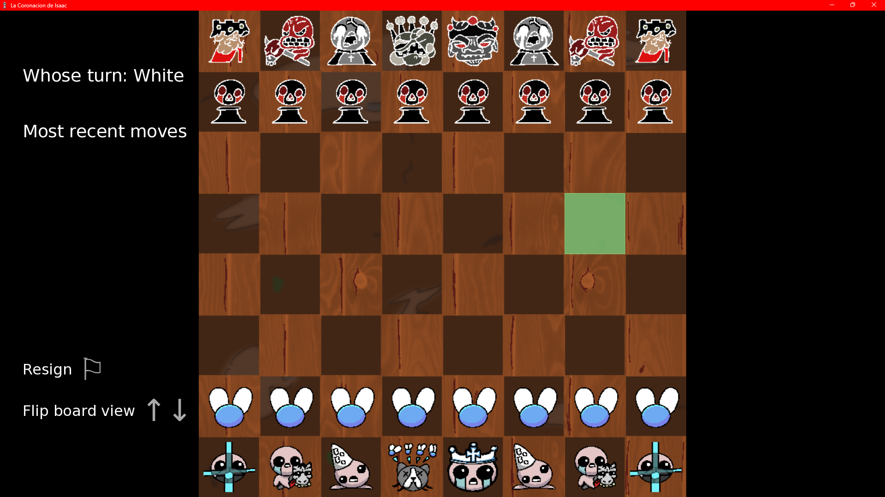

# My Ren’Py Chess Project

A custom Ren’Py chess game inspired by the *renpy-chess* open-source project, which provides a chess GUI built with Ren’Py, python-chess, and the Stockfish AI. This version includes original enhancements and integrations tailored to this project’s goals. 

## 🚀 About

This project builds on the **Ren’Py Chess Engine**, a chess graphical interface made using the Ren’Py engine, python-chess library, and the Stockfish chess AI to handle gameplay and computer opponents.

  
  

## 🎯 Features

- Player vs Computer
- Chess AI powered by Stockfish
- Clean board UI and interactive move highlighting
- Portable within Ren’Py visual novel projects
- Inmersive story with branching paths
- -Humor/Terror routes

## 📦 How to Run

1. Download the build version here: [Download](https://drive.google.com/drive/folders/1UCY56_NtAprxppDfIya0z7NXOzLSwo0W?usp=drive_link)

## 📚 Credits

This project uses and builds upon the **renpy-chess** engine by [r3dhummingbird (RuolinZheng08)](https://github.com/RuolinZheng08/renpy-chess), which is licensed under MIT. :contentReference[oaicite:3]{index=3}

## 📝 License

This project is licensed under MIT License — see the [LICENSE](LICENSE) file for details.

